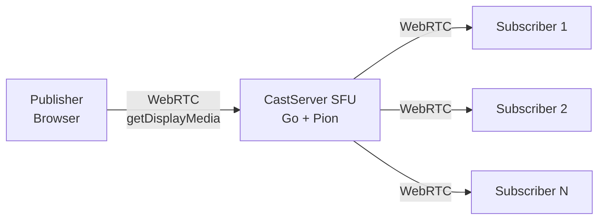

# CastServer

A lightweight, self-hosted WebRTC-based screen casting server. Share your screen (or a window/tab) to multiple viewers in real-time with sub-second latency — no plugins, no accounts, just a browser.

## Architecture



CastServer acts as a **Selective Forwarding Unit (SFU)**: the publisher's browser captures the screen via `getDisplayMedia`, streams it to the Go server over WebRTC, and the server relays RTP packets to all connected viewers without re-encoding.

## Features

- **One-to-many streaming** with sub-second latency
- **Multiple quality presets**: Low Latency (480p), Balanced (720p), High Quality (1080p), Native (passthrough)
- **Configurable FPS**: 10, 15, 20, 30, or 60
- **Codec selection**: Auto, H.264, VP9, or VP8
- **System audio sharing** alongside screen capture
- **Keyframe caching** for instant playback when a new viewer joins
- **RTCP forwarding** for adaptive bitrate and smooth playback
- **Auto-reconnection** — viewers reconnect automatically when the stream comes back
- **Diagnostics HUD** — live bitrate, FPS, encode/decode latency, RTT, jitter buffer, dropped frames
- **QR codes** per network interface for easy mobile access
- **Dark/light theme** toggle
- **Optional TURN server** for NAT traversal
- **Single self-contained binary** — static assets embedded via Go's `embed`

## Quick Start

### Prerequisites

- **Go** 1.25+
- **Node.js** and **npm** (for building the frontend)

### Build

```bash
# Clone the repo
git clone https://github.com/LETHEVIET/casting_things.git
cd casting_things

# Build the frontend
cd server/cmd/castserver/frontend
npm install
npm run build
cd ../../../..

# Build the server
cd server
go build -o castserver ./cmd/castserver
cd ..
```

### Run

```bash
./server/castserver --listen :1108
```

Then open:
- **Admin UI** (publish your screen): http://localhost:1108/
- **Viewer** (watch the stream): http://localhost:1108/web

### CLI Flags

| Flag | Default | Description |
|------|---------|-------------|
| `--listen` | `:1108` | HTTP listen address |
| `--turn-url` | (none) | TURN server URL for NAT traversal |
| `--turn-user` | (none) | TURN username |
| `--turn-pass` | (none) | TURN password |

### TURN Server Example

For streaming outside your local network, configure a TURN server:

```bash
./server/castserver --listen :1108 --turn-url turn:your-turn-server:3478 --turn-user user --turn-pass pass
```

## Setup Scenarios

### Cast to devices on the same network

The admin UI shows a list of local network IPs with QR codes. Viewers on the same WiFi / LAN just open the URL on any browser — desktops, tablets, phones:

| You publish from... | Viewers open... | Use case |
|---------------------|-----------------|----------|
| Desktop/laptop | `http://192.168.1.x:1108/web` | Cast slides to a tablet used as a second screen |
| Desktop/laptop | `http://192.168.1.x:1108/web` | Watch a design mockup live on your phone |

No NAT traversal needed — WebRTC uses host candidates within the same subnet.

### Cast remotely with Tailscale (no TURN needed)

[Tailscale](https://tailscale.com) creates a mesh VPN with direct peer-to-peer connections. Install Tailscale on the CastServer host and viewer devices, then just start the server normally:

```bash
./server/castserver --listen :1108
```

The server binds to all interfaces, so it's automatically reachable via the Tailscale IP. The admin UI detects network interfaces and will display the Tailscale URL alongside local IPs.

Now any device on your tailnet can open:
- Admin UI: `http://<tailscale-ip>:1108/`
- Viewer: `http://<tailscale-ip>:1108/web`

Tailscale handles NAT traversal at the network layer, so WebRTC host candidates work end-to-end without configuring a TURN server.

### Cast publicly with a TURN server

For public internet streaming, deploy a TURN server (e.g. [coturn](https://github.com/coturn/coturn)) and pass credentials:

```bash
./server/castserver --listen :1108 \
  --turn-url turn:turn.example.com:3478 \
  --turn-user myuser \
  --turn-pass mypassword
```

## API

| Endpoint | Method | Description |
|----------|--------|-------------|
| `/` | GET | Admin UI (publisher) |
| `/web` | GET | Viewer UI |
| `/health` | GET | Health check (`{"status":"ok"}`) |
| `/presets` | GET | List quality presets |
| `/stats` | GET | Real-time streaming stats (JSON) |
| `/stats/stream` | GET | Server-Sent Events stream of stats |
| `/interfaces` | GET | List local network IPs |
| `/webrtc/publish` | WebSocket | Publisher signaling |
| `/webrtc/subscribe` | WebSocket | Subscriber signaling |
| `/webrtc/stop` | POST | Force-stop active session |

## Tech Stack

| Layer | Technology |
|-------|-----------|
| Backend | Go (Pion WebRTC, Gorilla WebSocket) |
| Frontend | Svelte 4 + TypeScript |
| Build | Vite 5 |
| Styling | Tailwind CSS 3 + Flowbite |

## Project Structure

```
server/
├── cmd/castserver/
│   ├── main.go          # Entry point
│   ├── static/           # Embedded frontend build output
│   └── frontend/         # Svelte source
│       └── src/
│           ├── App.svelte
│           ├── Admin.svelte    # Publisher UI
│           ├── Viewer.svelte   # Viewer UI
│           └── lib/
│               ├── api.ts      # TypeScript types
│               └── qrcode.ts   # QR code generator
└── internal/
    ├── control/          # HTTP handlers, stats, presets
    └── sfu/              # WebRTC peer management, keyframe cache
```

## License

MIT
